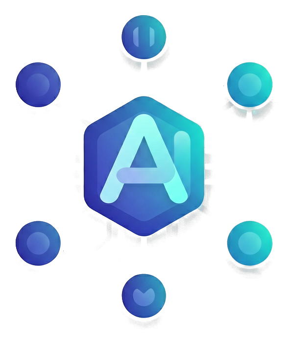

# agenthicc

**A state-driven agent operating system for autonomous software engineering.**

<p align="center">
  
</p>

```
pip install agenthicc   # or use uv — see Install below
```


---

## What it does

agenthicc runs **agent turns** inside your project with full filesystem, git, and command tooling. It keeps durable session records so you can inspect, resume, and replay work at any time.

### Key capabilities

| Feature | Description |
|---|---|
| **Terminal workspace** | Rich Live TUI with approvals, overlays, modes, slash commands, workflow progress, and a pinned composer |
| **Headless mode** | Stdin-based JSON-lines interface for pipelines and CI |
| **State-driven kernel** | Immutable domain state with JSONL persistence and event sourcing |
| **Workflow system** | `code_plan`, `create_workflow`, `copy_website`, `reconstruct_site`, `site_imitate`, and user-authored workflows with typed state machines |
| **Extension registries** | Tools, agents, skills, modes, commands, and MCP servers |
| **Memory** | Session, project, and global memory with durable conversation journaling |
| **Context budgeting** | Model-aware compaction, transport retries, and tool-result replay for interrupted/resumed turns |
| **Background sessions** | Detached long-running work with `/bg`, resume, retry, and cancellation |
| **Session service** | HTTP/SSE attachment transport for programmatic session access |

### Built-in workflows

| Workflow | Purpose |
|---|---|
| `code_plan` | Plan-and-execute code changes with approval gates |
| `create_workflow` | Author new workflows interactively |
| `copy_website` | Study a website with Playwright and rebuild it as a mobile-friendly Next.js application |
| `reconstruct_site` | Reconstruct a reference website through evidence-first responsive research, implementation, and validation phases |
| `site_imitate` | Generate mobile-first responsive websites (viewport checks enforced) |

---

## Quick start

### Requirements

- Python 3.11 or newer (3.12 and 3.13 exercised in CI)
- [`uv`](https://docs.astral.sh/uv/) for the recommended development workflow
- An LLM provider: Anthropic (default), OpenAI, Ollama, or LiteLLM

### Install

```bash
git clone https://github.com/agenthicc/agenthicc.git
cd agenthicc
uv sync --extra dev
```

### Configure your provider

```bash
# Anthropic (default)
export ANTHROPIC_API_KEY="sk-ant-..."

# OpenAI
export OPENAI_API_KEY="sk-..."
uv run agenthicc --set execution.provider=openai --set execution.model=gpt-4o

# Ollama (no API key needed)
uv run agenthicc --set execution.provider=ollama --set execution.model=llama3.2
```

You can also persist configuration in `.agenthicc/agenthicc.toml`, `agenthicc.toml`, or a user config file. See the [configuration guide](./docs/guides/configuration.md) for precedence rules.

### Launch

```bash
uv run agenthicc
```

Enter a natural-language request:

```text
> inspect the authentication module, propose a safe refactor, and run its tests
```

The default session discovers built-in and project-local workflows, agents, tools, skills, modes, and MCP servers. New sessions start in **Safe** mode — reads run directly; writes, command execution, git changes, network access, and unannotated tools ask for approval.

Startup is progressive: the TUI renders its first frame from the local
session/configuration boundary while optional extensions, remote changelog,
MCP connections, and browser integrations report readiness in the background.
Use `/startup` to inspect phase timings. Session listing uses a bounded index
and restores only the selected session; see the [startup guide](./docs/guides/startup.md).

### Headless mode

```bash
printf '%s\n' 'summarise the repository' | uv run agenthicc --headless
printf '%s\n' 'run the workflow' | uv run agenthicc --headless --mode Plan --workflow code_plan
uv run agenthicc workflows list
uv run agenthicc workflows run code_plan --intent 'implement the feature' --json
```

For an interactive session, `--mode MODE` selects the initial runtime mode and
`--workflow NAME` selects the initial workflow. The explicit workflow overrides
the mode's default; with `--headless`, the workflow is run for each non-empty
stdin line.

---

## Terminal workspace

The current TUI is implemented by `tui/workspace/Workspace` and consists of:

1. A scroll buffer for conversation, tool, workflow, and system events
2. A live status/composer/footer block owned by the workspace
3. Overlays for help, command and skill listings, configuration, approvals, questions, plans, and trigger completion
4. A single lifetime input session with POSIX and Windows terminal backends

The workspace treats terminal resizing as one settled repaint, clearing Rich's previous geometry before redrawing so an active Plan Review is not duplicated in the scrollback. While approvals, plan reviews, or questions are waiting, the status animation and cached active-work timer stay fixed; the wall-clock duration is retained for turn telemetry.

Idle sessions do not publish animation frames or repaint the unchanged Live status at the session tick rate, preventing duplicate idle panels in captured terminal output. Approval, plan-review, and question waits likewise retain their wall-clock telemetry without repainting an unchanged prompt every tick.

Tool completions use the same operation-style header as file updates: reads, searches, commands, and other tools show a `● Operation(...)` header, a result summary, and a bounded numbered output preview. File changes retain their unified diff preview; long contiguous change blocks are abbreviated to six edge rows with a single `...` omission marker. Collapsed tool-group summaries are also flushed to the scroll buffer when an active agent is interrupted.

### Built-in slash commands

| Command | Purpose |
|---|---|
| `/help`, `/commands` | Inspect available commands in an overlay |
| `/tools [reload]`, `/workflows [runs\|reload]` | Inspect tools/workflows, or open the paginated paused-run selector; `/tools` labels each tool `builtin` or `plugin` |
| `/status`, `/history` | Inspect runtime status and session events |
| `/ps [terminal-id]`, `/stop [terminal-id\|all]` | Inspect or stop owned background terminals; `/stop` stops all |
| `/mode [name]` | Show or change the operating mode |
| `/workflow <name> \| reset` | Select a workflow (the interactive picker autocompletes registered names); use `/workflow create_workflow` to author one directly in `.agenthicc/workflows/` |
| `/model [provider] [model]` | Inspect or switch the model selection |
| `/config` | Open the configuration overlay |
| `/init` | Preview or explicitly write managed project `AGENTS.md` guidance |
| `/compact` | Compact conversation memory |
| `/replay [session-id]` | Replay a saved conversation |
| `/cancel`, `/clear`, `/expand` | Control the current session or output |
| `/mcp`, `/skills [reload]` | Inspect MCP and skills; reload or open their overlay |
| `/usage` | Show durable session usage, cost quality, run state, and queued input |
| `/create-tools <instructions>` | Ask the agent to create lauren-ai tools |
| `/create-commands <instructions>` | Ask the agent to create slash commands |

`/tools reload` loads every tool plugin that can be loaded and reports any
broken or dependency-missing plugins. If none can be loaded, the existing
tool registry is kept active.

`/config` opens its local configuration overlay immediately, including while a response is streaming.

`/workflows runs` opens a paginated list of paused and interrupted workflow
checkpoints, newest first. Select a run with the arrow keys, then press Enter
to rehydrate and resume it through the same validation and live-owner claim
path as `/workflow resume <run-id>`.

Large bracketed pastes stay condensed in the composer. Backspace removes the whole paste when the cursor is immediately after its closing `]`; elsewhere it keeps normal character-wise editing. Home and End navigate the visible, single-line placeholder, so typing at either side keeps the original pasted content intact.

Use `Ctrl+C` according to the current input state; the input backend owns raw terminal mode and restores it on shutdown. See the [TUI guide](./docs/guides/tui.md) for modes, overlays, input, busy-run command policies, and platform rules. ESC returns the input state to idle immediately after cancelling a run, so the double-Ctrl+C exit sequence remains responsive on Windows.

---

## Modes

| Mode | Behavior |
|---|---|
| **Safe** (default) | Reads run directly; writes, command execution, git changes, network access, and unannotated tools ask for approval |
| **Plan** | Hard-blocks side effects; requires explicit approval for all writes |
| **Yolo** | Unrestricted mode formerly named Auto |

Access is enforced by mode restrictions, capability metadata, and approval settings.

---

## Workflows

Workflows are typed state machines with explicit transitions. The built-in `code_plan` workflow guides agents through design, generate, validate, and summarize phases with approval gates.

### Authoring workflows

Create a specialized workflow with `/workflow create_workflow`. It runs `design → generate → validate → summarize` on the same state-machine pattern as `code_plan`:

1. The design is presented for your approval
2. The generate phase writes a complete workflow package to a run-owned draft under `.agenthicc/workflows/.drafts/<run-id>/<name>/` (with workflow-specific tools/helpers in sibling files) and records a manifest
3. The validate phase imports the draft, runs a bounded fake-provider smoke check, and loops back to generate until it passes — an approval of a file that does not import or smoke-test is overridden
4. Only after validation and approval does the framework atomically publish the package to `.agenthicc/workflows/<name>/`; failed publication leaves the draft and checkpoint recoverable

For non-trivial behavior the agent is guided to create a `code_plan`-style custom runner with typed states, context, per-state functions, explicit `match` transitions, and resumable execution; simple workflows can use declarative `PhaseSpec` values. Run `/workflows reload` and then `/workflow <name>` after authoring.

### Workflow inspection tools

Each authoring phase has its own prompt and bounded multi-turn budget; tune the caps with `[execution].authoring_max_phase_turns` and `[execution].authoring_max_generation_attempts`. The agent inspects the real authoring API with built-in tools:

- `describe_phasespec`
- `list_tool_capabilities`
- `list_agent_roles`
- `describe_cloakbrowser_tools`
- `describe_playwright_tools`
- `describe_runner_pattern`
- `describe_transition_tool_pattern`
- `show_example_workflow`
- `describe_prompt_cache_contract`
- `show_workflow_template`
- `validate_workflow_cache_contract`
- `inspect_agenthicc_source`
- `search_agenthicc_source`
- `list_agenthicc_docs`
- `read_agenthicc_doc`
- `search_agenthicc_docs`

Authoring turns also receive a bounded, redacted live snapshot of effective
tool schemas, capability decisions, workspace/cache/checkpoint policy, and
browser/MCP availability. `describe_authoring_session` returns the snapshot;
`explain_authoring_tool_access` explains why an individual tool is available or
blocked. Secrets, headers, prompt contents, and tool arguments are excluded.

The catalog and inspection tools are read-only and available in Plan mode.
`validate_workflow_cache_contract` is execute-gated because it imports the target
workflow; generation receives it after the package is written and must use it
only with a trusted generated path. Browser descriptions report the live
backend tool names and distinguish a configuration-enabled optional integration
from a selected or installed backend.

### Cache stability contract

Generated custom runners receive a cache-stability contract: immutable workflow policy and deterministic tool schemas stay in the reusable prefix, while phase state, artifacts, questions, answers, and summaries stay dynamic. The authoring agent is instructed to declare a literal `CACHE_CONTRACT`, pass it as `stable_system_prompt` to `CodePlanRunner.run_phase()`, and use `ask_user` instead of guessing over material ambiguity. Strict validation rejects runners that bypass this boundary or mutate the shared conversation history.

Generated custom runners must also use the parent session conversation and
memory, inherit its workspace and browser/MCP policy, provide bounded JSON
checkpoint codecs, resume the saved state, and re-raise ordinary errors to the
framework failure finalizer. Simple unconditional graphs may use the generic
runner.

The built-in `make_agenthicc_tool` workflow follows the same boundary across
its analyze, generate, validate, and finalize phases; tool plans, generated
paths, validation reports, and retry state remain dynamic rather than changing
the reusable system prefix.

All built-in workflow runners use this boundary: `code_plan`, `create_workflow`,
`site_imitate`, `make_agenthicc_tool`, and `make_book`.

`make_book` phase handoffs use one required argument: a concise `summary`.
The agent writes the TOC manifest, research, many visual assets, chapters, and
book matter to disk first; the runner derives and verifies their paths,
inventories, counts, and PDF output. The assets phase requires at least
`max(6, 3 * chapter_count)` varied files, including a free Unsplash raster and
`assets/unsplash/manifest.json`; Unsplash+ and paid sources are rejected. See
the [workflow guide](./docs/guides/workflows.md#make_book-phase-handoffs) for
the exact calls and artifact layout. `make_book` uses two layout-review phases:
referenced images/diagrams and Markdown tables must fit within the default
8×11.5-inch page with 0.75-inch margins: no more than 6.175 inches wide (95%
of the 6.5-inch content width) or 8.05 inches high (70% of page height). The
builder generates the TOC from chapter headings, stages raster assets at 600
DPI while preserving aspect ratio, builds a matching reflowable EPUB, and
agents must not write `contents.md`.

### Transition tools

Transition tools in generated runners must use the canonical bare `@tool_control` decorator imported from `agenthicc.tools.capabilities`, above `@tool()`. The authoring inspection tool `describe_transition_tool_pattern` shows the exact form, and strict validation catches factory-local import or decorator mistakes before the workflow is accepted.

If a selected workflow fails before it can attach typed context, the TUI renders
the exception as an error event and stores a diagnostic-only failure; there is
no safe state from which to resume. Once typed context is attached, ordinary
startup and phase exceptions are paused and resume the same run instead of
discarding it for a fresh attempt.

---

## Background sessions

Long-running work can be detached from an active session with `/bg` or `/background`. Run `agenthicc agents` (or `agenthicc jobs`) to open the background-session manager, where you can inspect, follow, resume, retry, cancel, and safely delete sessions. `Ctrl+X` deletes the selected session only after confirmation; `u` restores it from recoverable trash. See the [background sessions guide](./docs/guides/background-sessions.md) for workflow support, approvals, input requests, retention, and privacy details.

Execution tools remain foreground by default. Pass `background=true` to `run_bash` or `run_command` to receive an owned `term-...` handle, then call `wait_terminal` when the result is needed. While a wait is active, `/ps`, `/stop`, and `Esc` remain responsive; `/stop` stops all owned background terminals, while `Esc` stops the terminal currently being awaited. Terminal handles and bounded output are local-only and scoped to the originating session.

For finite builds, use an explicit `cwd` and a seconds-based `timeout`; a non-zero exit, timeout, cancellation, or spawn failure is always reported as a failed command. For development servers, use `lifecycle="service"` with a readiness probe rather than waiting for a process that is intended to remain alive. See the [command execution guide](./docs/guides/command-execution.md) for result states, readiness controls, workflow gates, and diagnostics.

---

## Session service

All clients can inspect the same client-neutral session projection. The new `session` commands use the shared snapshot, command, and replay contracts:

```bash
uv run agenthicc session list --json
uv run agenthicc session show SESSION_ID --json
uv run agenthicc session events SESSION_ID --after 12
uv run agenthicc session export SESSION_ID --output session-export.json
uv run agenthicc session send SESSION_ID --text 'continue the work'
uv run agenthicc session control SESSION_ID cancel
```

The default session service is in-process and stores its projection under `~/.agenthicc/session-service/`. `agenthicc session serve` is an explicit loopback-only HTTP/SSE attachment transport; non-loopback binding requires a bearer token. It is an adapter over the existing session/kernel runtime, not a second agent server. See the [client-neutral session guide](./docs/guides/session-service.md).

---

## Architecture

```text
user input
    │
    ▼
TUISession / headless runner
    │  creates turns, selects workflow, injects tools
    ├────────────────────────────────────┐
    ▼                                    ▼
reactive TUI AppState         kernel EventProcessor
    │                              │
Workspace + input             Event → root_reducer → frozen kernel AppState
    │                              │
    └────────────────────────────┬─┘
                   ▼
          workflow + agent turns
                   │
          capability-gated tools
                   │
       session / project / global memory
```

The kernel `AppState` and the reactive TUI `AppState` are different types with different responsibilities. The session runner currently owns the bridge between them. This boundary is documented in the [architecture guide](./docs/guides/architecture.md) and is a P0 design item in [PRD-138](./prds/prd-138-repository-improvement-roadmap.md). For the full evidence-backed checkout audit, see the [current repository state reference](./docs/reference/repository-state.md).

---

## Extension points

| Extension | Current location | Discovery |
|---|---|---|
| Tools | `.agenthicc/tools/`, `~/.agenthicc/tools/` | `TOOLS` export; capability metadata; review executable code manually |
| Agents | `.agenthicc/agents/`, `~/.agenthicc/agents/` | `AgentPlugin` subclasses or `AGENTS` export |
| Modes | `.agenthicc/modes/`, `~/.agenthicc/modes/` | Mode plugin loader |
| Workflows | `.agenthicc/workflows/`, `~/.agenthicc/workflows/` | `WorkflowPlugin` subclasses |
| Skills | `.agenthicc/skills/`, `~/.agenthicc/skills/` | `SKILL.md` directories |
| Commands | `.agenthicc/commands/`, `~/.agenthicc/commands/` | `COMMAND`/`COMMANDS` exports; manual code review |
| MCP | `[[tools.mcp_servers]]` | configured server bridge; structured results preserved |

Explicit skills use the `$skill-name` or `$alias` trigger; `/` remains reserved for commands. `/commands` lists slash commands only; use `/skills` to inspect discovered skills. The former `/skill-name` spelling is not executed.

In a registry overlay, press Enter on an entry to open its details. Press Enter again on the details page to place the invocation in the input panel: `/workflow <name>` for workflows, the command's canonical `/name` for commands, and `$<skill-name>` for skills. The text is prepared but not submitted.

### Installing skills

Install validated skills from a local path, direct HTTPS `SKILL.md` URL, or a generic GitHub repository with `agenthicc skills add SOURCE`. Both `https://github.com/owner/repo.git` and `owner/repo` sources are supported; repository sources discover and install all valid skills by default. Use `--skill NAME[,NAME]` to select specific skills, `--all` to make full installation explicit, and `--global` for user-global scope. Existing skill directories are never overwritten. Review downloaded instructions before invoking a newly installed skill.

### Registering MCP servers

Register an MCP server without hand-editing TOML with `agenthicc mcp add NAME URL`. Project scope is the default; use `--global` for the user configuration, `--transport` to select the existing bridge transport, and `--token-env ENV_VAR` to persist a token reference without exposing the secret to the CLI. A local Lauren MCP directory or `server.py` is also accepted for stdio servers and is converted to an `lmcp run ... --stdio` launcher. The command validates and appends configuration but does not connect to the server itself.

Read the [extension guide](./docs/guides/plugins.md) and the [custom-command guide](./docs/guides/commands.md) before enabling project code or dependency installation. Project-local Python is executable code and must be reviewed deliberately.

---

## Persistence and resume

Session artifacts live below `~/.agenthicc/sessions/`:

| File | Purpose |
|---|---|
| `<session-id>.jsonl` | Kernel event log |
| `<session-id>/conversation.jsonl` | Rendered conversation events; resumed TUI sessions replay the newest 20 complete turns |
| `<session-id>/conversation-journal.jsonl` | Durable conversation-memory transitions used for crash recovery and tool replay |
| `<session-id>/workflows/<run-id>/checkpoint.json` | Atomic JSON workflow context checkpoints with no framework-imposed byte ceiling, used by `/workflow resume` after an Esc pause |
| `<session-id>/workflows/<run-id>/.claim` | Atomic live-owner lease; stale zombie/PID-reuse claims are recoverable, while live duplicate owners are rejected |
| Optional cassette files | Recorded transport and approval interactions |

Direct chat, Plan mode, `code_plan`, and `create_workflow` share the session's stable conversation ID and journal-backed provider memory. Workflow phase state is checkpointed separately, while the reactive conversation store remains a UI projection.

If a workflow receives any ordinary exception — including a transient provider
error such as HTTP 429, a tool error, timeout, `ValueError`, `OSError`, or
cancellation — agenthicc saves the same workflow `run_id` and active typed
phase before returning to idle. `continue`, `/workflow resume`, `--continue`,
and `--resume` then reload that checkpoint and call the workflow's
`resume(context)` path at the saved phase. They do not create a new run or
replay `INIT`; `INIT` is used only for a new run or when it was the actual phase
at failure. A failure is diagnostic-only only when typed state is unavailable or
the checkpoint cannot be durably written. See the [workflow guide](./docs/guides/workflows.md#pause-crash-recovery-and-workflow-resume)
for the recovery data flow and failure cases.

If multiple workflow checkpoints are recoverable, the TUI wraps the complete
run IDs in its recovery notice so an exact `/workflow resume <run-id>` command
can be entered.

If `/workflow resume` reports `run_already_claimed`, another live agenthicc
process owns that workflow run. Close or resume it in that process before
retrying; this guard prevents duplicate side effects from concurrent resumes.
Claims are written atomically and carry a process-start identity where the
platform supports it, so interrupted processes do not strand recoverable runs.
Explicit resume refreshes the durable checkpoint index and can resolve a
uniquely identifiable ID copied from the claim diagnostic, so a stale startup
snapshot or terminal-font confusion does not turn the retry into
`run_not_found`.

Tool-call batches are transaction-safe at the shared `lauren-ai` boundary.
Every assistant call is paired with exactly one result before the next provider
request; interrupted or denied calls receive a bounded synthetic error result
and the repair is persisted in the conversation journal. If history is
ambiguous, the request is blocked locally with a safe invariant diagnostic
instead of sending a malformed provider payload.

A streaming user turn may contain multiple provider steps. A late provider
failure retries only its current step and preserves all earlier committed
assistant/tool messages. The journal records step starts, commits,
interruptions, and a terminal `turn_failed` marker; bounded partial output is
shown as interrupted transcript evidence, never as a completed assistant
message. A subsequent message continues with the same session memory and
conversation ID, so it can ask about or build on work completed before the
failure.

Export a portable, redacted support artifact with:

```bash
uv run agenthicc sessions inspect SESSION_ID
uv run agenthicc sessions export SESSION_ID --output session-export.json
```

Inspection reports artifact health, corruption, token usage, workflow status, and whether a turn needs resume without printing conversation or tool payloads. The export includes valid records from the kernel, conversation, journal, and cassette stores. Credential-shaped values are redacted and malformed JSONL records are reported in the manifest. Review prompts, tool results, paths, and model output before sharing an export.

Resumed sessions are single-owner. If another terminal is using the selected
session, `--continue`, `--resume`, or session-picker Enter exits with
`session_already_active` (status `3`) before transcript, tools, or the provider
are initialized; it never falls back to another session. A crashed owner can
be reclaimed only when local process liveness proves it is dead.

Project memory and the workspace file cache live below `.agenthicc/`; global memory defaults to `~/.agenthicc/global.db`. See the [storage reference](./docs/reference/storage.md) before deleting session or project state.

---

## Configuration example

```toml
# .agenthicc/agenthicc.toml

[execution]
provider = "anthropic"
model = "claude-opus-4-8"
max_concurrent_intents = 8
max_parallel_tasks = 4
max_agent_turns = 200
authoring_max_generation_attempts = 20
authoring_max_phase_turns = 20
auto_compact = true
transport_max_retries = 3

[memory]
project_memory_path = ".agenthicc/memory"
session_ttl_seconds = 86400

[security]
sandbox_mode = true
# Use the real absolute project path, not the illustrative /workspace path.
allowed_paths = ["/absolute/path/to/project"]
network_allow_list = []

[tools]
max_live_tool_calls = 5
group_exploratory_calls = true  # presentation-only grouping of marked reads
browser_backend = "cloakbrowser"  # cloakbrowser, playwright, or none

# Optional browser automation; enabled with liberal local/VPS access by default.
[tools.cloakbrowser]
enabled = true
allowed_domains = []
allow_all_domains = true  # allow localhost, private addresses, and all HTTP(S) hosts
```

Filesystem access uses the active mode and the same canonical workspace scope
across mentions, tools, commands, and workflows. Safe asks before an exact
target outside `security.allowed_paths` is read, written, listed, searched, or
used as a command working directory; Plan denies that access without prompting;
Yolo permits the exact target subject to operating-system and runtime limits.
`--dangerously-skip-permissions` does not bypass this workspace decision.

### Browser backends

CloakBrowser is an optional dependency. Install it only when browser tools are needed with `pip install 'agenthicc[cloakbrowser]'` or `uv sync --extra cloakbrowser`; base installations do not import or require it.

Microsoft Playwright is an alternative backend. Select it explicitly and install its optional package and browser runtime:

```bash
uv sync --extra playwright
uv run playwright install chromium
```

From another uv project, such as a sibling `python-password-generator` checkout, use an editable requirement because `uv sync --extra` reads the consumer project's extras:

```bash
uv run --no-project --with-editable '../agenthicc[playwright]' playwright install chromium
OPENAI_API_KEY='...' OPENAI_MODEL='...' OPENAI_BASE_URL='...' \
  uv run --no-project --with-editable '../agenthicc[playwright]' agenthicc --continue
```

```toml
[tools]
browser_backend = "playwright"

[tools.playwright]
enabled = true
browser_type = "chromium"
allowed_domains = []
allow_all_domains = true  # allow localhost, private addresses, and all HTTP(S) hosts
```

Playwright exposes the same bounded browser operations with `playwright_*` names. Domain, DNS, artifact, quota, and checkpoint policies are shared with the CloakBrowser adapter. The two backends are mutually exclusive per session, and neither optional package is imported unless its backend is selected. Browser access is liberal by default: localhost, private addresses, arbitrary HTTP(S) hosts, and any destination port are permitted. Set `allow_all_domains = false` and provide an allow-list when a narrower policy is required.
After orderly session cleanup, the existing injected browser tool closures can
be used again: the next `*_open` lazily creates a fresh context and clears
stale page and operation state. Provider-turn failure cleanup is recoverable
and does not permanently close those retained tools. Live pages are
intentionally not restored.

Config layers are merged in this order: built-in defaults, user config, project config, environment variables, then repeated `--set key=value` overrides. Run `uv run agenthicc config show` to inspect the effective values; never print secrets in support logs.

### Named provider profiles

Named provider profiles also support OpenAI-compatible endpoints such as Modal without a provider-specific SDK. They carry endpoint headers, request options, sampling, retries, and environment-backed secrets through direct turns, workflows, subagents, and resume:

```toml
[execution]
profile = "modal"

[providers.modal]
provider = "openai"
model = "moonshotai/Kimi-K3"
base_url = "https://your-endpoint.modal.run/v1"
api_key_env = "MODAL_API_KEY"
```

Use `agenthicc config validate` before a run; secret values are never printed. For one-off credentials, use `--set-secret PATH=ENV_VAR`; it stores only an environment-variable reference and resolves the value at provider startup.

---

## Provider configuration

Anthropic is the default provider. Set one provider's credentials before starting a real agent turn:

```bash
# Anthropic
export ANTHROPIC_API_KEY="sk-ant-..."

# OpenAI
export OPENAI_API_KEY="sk-..."
uv run agenthicc --set execution.provider=openai --set execution.model=gpt-4o

# Ollama needs no API key
uv run agenthicc --set execution.provider=ollama --set execution.model=llama3.2
```

You can set the provider, model, base URL, and execution options in `.agenthicc/agenthicc.toml`, `agenthicc.toml`, or a user config file. See the [configuration guide](./docs/guides/configuration.md) for precedence and the supported settings.

---

## Subagents

The built-in `spawn_subagents` tool delegates independent tasks to typed,
concurrent workers. Workers inherit the parent tool ceiling, capability gate,
approval service, workspace policy, provider options, and usage accounting;
each still has isolated short-term memory. The `executor` role supports build
and compile tasks, while `explorer`, `planner`, `implementer`, `tester`,
`reviewer`, `documenter`, `verifier`, and `researcher` provide narrower roles.
Timeouts and partial failures are reported in the aggregate and are not reused
by resume. Each call accepts `timeout_s` in seconds (default `3600`). See the
[subagents guide](./docs/guides/subagents.md) for the exact schema, lifecycle,
security boundaries, cache semantics, and troubleshooting steps.

---

## Built-in documentation tools

Every session carries five read-only tools for reading agenthicc itself — `list_agenthicc_docs`, `read_agenthicc_doc`, `search_agenthicc_docs`, `inspect_agenthicc_source`, and `search_agenthicc_source`. They serve the `docs/` tree plus `llms.txt`, `llms-full.txt`, and `README.md`, and resolve any `agenthicc` module or symbol (including private names) by parsing the file rather than importing it. All five are read-only, so they stay available in Plan mode.

---

## Development

```bash
uv sync --extra dev

# Fast checks
uv run ruff check src/ tests/ scripts/
uv run ruff format --check src/ tests/ scripts/
uv run mypy src/agenthicc
uv run python scripts/type_audit.py --check docs/reference/type-safety-baseline.json
uv run pytest tests/unit -q

# Broader suites
uv run pytest tests/integration -q
uv run pytest tests/e2e -q
uv run pytest tests/ -q
```

Nox contains the CI session definitions (`noxfile.py`), including the embedded `llms-full.txt` symbol check. Its dependency installation paths are being aligned with `pyproject.toml`; see [contributing](./docs/contributing.md) and [PRD-138](./prds/prd-138-repository-improvement-roadmap.md) before using the default all-session invocation on a clean checkout.

---

## Documentation map

- [Quickstart](./docs/guides/quickstart.md)
- [Architecture](./docs/guides/architecture.md)
- [Configuration](./docs/guides/configuration.md)
- [Connecting MCP servers](./docs/guides/mcp.md)
- [Project bootstrap](./docs/guides/project-bootstrap.md)
- [TUI](./docs/guides/tui.md)
- [Background sessions](./docs/guides/background-sessions.md)
- [Workflows](./docs/guides/workflows.md)
- [Custom workflows and TOML configuration](./docs/guides/custom-workflows-and-config.md)
- [User-defined commands](./docs/guides/commands.md)
- [User-defined tools](./docs/guides/tools.md)
- [Extensions and plugins](./docs/guides/plugins.md)
- [Memory and storage](./docs/guides/memory.md)
- [Security](./docs/guides/security.md)
- [Testing](./docs/guides/testing.md)
- [Type safety](./docs/guides/type-safety.md)
- [CLI reference](./docs/reference/cli.md)
- [Kernel reference](./docs/reference/kernel.md)
- [Storage reference](./docs/reference/storage.md)
- [Repository improvement PRD](./prds/prd-138-repository-improvement-roadmap.md)

AI-assisted contributors should also read [`AGENTS.md`](./AGENTS.md), [`CLAUDE.md`](./CLAUDE.md), [`llms.txt`](./llms.txt), and [`llms-full.txt`](./llms-full.txt).

---

## License

MIT. See [LICENSE](./LICENSE).
