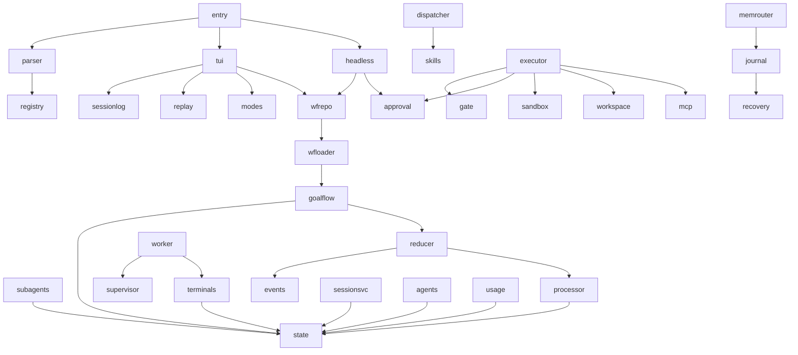

# Architecture diagram

How the packages fit together at runtime, with every node in the picture
naming a real file. The rule this page follows: **a node that is not a path
under `src/agenthicc/` does not belong in the diagram.** If a module moves, the
diagram is wrong and this page must change.

## Layers

Read top to bottom. Each layer may call the layer below it; nothing calls
upward.

```text
                        ┌──────────────────────────────┐
   LAYER 5  entry       │  agenthicc/__main__.py       │
                        │  main() -> one of three      │
                        └───────────────┬──────────────┘
                                        │
                        ┌───────────────▼──────────────┐
   LAYER 4  cli         │  cli/parser.py  parse_cli()  │
                        │  cli/registry.py  _wire()    │
                        └───────┬──────────────┬───────┘
                                │              │
             ┌──────────────────▼───┐      ┌───▼──────────────────┐
   LAYER 3   │ runners/             │      │ runners/             │
   runners   │  tui_session.py      │      │  headless.py         │
             │  (interactive)       │      │  (no TUI)            │
             └──────────┬───────────┘      └──────────┬───────────┘
                        │                             │
                        └──────────────┬──────────────┘
                                       │
             ┌─────────────────────────▼─────────────────────────┐
   LAYER 2   │  orchestration                                    │
   coord.    │  workflows/registry.py   agents/registry.py       │
             │  subagents/pool.py       commands/dispatcher.py   │
             │  background/supervisor.py  session_service/       │
             └─────────────────────────┬─────────────────────────┘
                                       │
             ┌─────────────────────────▼─────────────────────────┐
   LAYER 1   │  kernel (event-sourced, no upward dependencies)   │
   kernel    │  kernel/events.py   kernel/reducer.py             │
             │  kernel/state.py    kernel/processor.py           │
             └───────────────────────────────────────────────────┘

   CROSS-CUTTING (called by layer 2 and 3, not by the kernel):
     tools/executor.py · tools/capability_gate.py · tools/approval.py
     tools/sandbox.py · tools/workspace_access.py · tools/mcp_manager.py
     memory/router.py · memory/journal.py · skills/loader.py
```

The important property is at the bottom: `agenthicc.kernel` imports none of the
layers above it. That is what lets a session be rebuilt from a log.

## Nodes

Every node id used in the diagrams on this page, mapped to the file that
implements it.

| Node | Path | Responsibility |
|---|---|---|
| `entry` | `src/agenthicc/__main__.py` | Parse argv, then dispatch to a subcommand, headless, or TUI |
| `parser` | `src/agenthicc/cli/parser.py` | Build the argument parser and the `CLIContext` |
| `registry` | `src/agenthicc/cli/registry.py` | Discover `@command(...)` entries and wire them into the parser |
| `tui` | `src/agenthicc/runners/tui_session.py` | Drive an interactive session |
| `headless` | `src/agenthicc/runners/headless.py` | Drive a session with no TUI |
| `modes` | `src/agenthicc/tui/runtime/mode_manager.py` | Active mode, `UnknownModeError`, TUI mode registry |
| `sessionlog` | `src/agenthicc/tui/runtime/session_log.py` | Session ids, index, and append-only log |
| `replay` | `src/agenthicc/tui/runtime/replay.py` | Rebuild a transcript from a log without duplicating entries |
| `events` | `src/agenthicc/kernel/events.py` | `Event`, `Effect`, `EffectType` |
| `reducer` | `src/agenthicc/kernel/reducer.py` | `root_reducer` and the 20-entry `_HANDLERS` map |
| `state` | `src/agenthicc/kernel/state.py` | `AppState` and every record it holds |
| `processor` | `src/agenthicc/kernel/processor.py` | Fold events, hand effects to an executor |
| `wfrepo` | `src/agenthicc/workflows/registry.py` | Name-to-workflow map and `build_workflow_registry()` |
| `wfloader` | `src/agenthicc/workflows/loader.py` | Load built-in and project workflow modules |
| `goalflow` | `src/agenthicc/workflows/goal_flow/runner.py` | The reference implement/verify workflow |
| `agents` | `src/agenthicc/agents/registry.py` | Resolve the seven built-in agent roles |
| `subagents` | `src/agenthicc/subagents/pool.py` | Concurrency-limited delegated workers |
| `dispatcher` | `src/agenthicc/commands/dispatcher.py` | Resolve and run slash commands |
| `supervisor` | `src/agenthicc/background/supervisor.py` | Start and reap background workers |
| `worker` | `src/agenthicc/background/worker.py` | Run one background session |
| `terminals` | `src/agenthicc/background/terminals.py` | Durable background terminal records |
| `sessionsvc` | `src/agenthicc/session_service/service.py` | Client-neutral session transport |
| `executor` | `src/agenthicc/tools/executor.py` | Execute a registered tool call |
| `gate` | `src/agenthicc/tools/capability_gate.py` | Refuse calls the active mode does not permit |
| `approval` | `src/agenthicc/tools/approval.py` | Approval request/response and gate |
| `sandbox` | `src/agenthicc/tools/sandbox.py` | Workspace view, network guard, resource limits |
| `workspace` | `src/agenthicc/tools/workspace_access.py` | Workspace scope and path resolution |
| `mcp` | `src/agenthicc/tools/mcp_manager.py` | MCP server connections and isolation |
| `memrouter` | `src/agenthicc/memory/router.py` | Route reads and writes to a memory tier |
| `journal` | `src/agenthicc/memory/journal.py` | Durable conversation record for recovery |
| `skills` | `src/agenthicc/skills/loader.py` | Validate skill frontmatter into `SkillDef` |
| `usage` | `src/agenthicc/runners/usage_ledger.py` | Token and cost accounting rows |
| `recovery` | `src/agenthicc/runners/recovery_projection.py` | Project an interrupted call into the transcript |

## Edges

What actually crosses each boundary, and why the direction matters.

| From | To | Crossing |
|---|---|---|
| `entry` | `parser` | argv |
| `entry` | `tui` | `CLIContext`, when not headless |
| `entry` | `headless` | `CLIContext`, when `--headless` |
| `parser` | `registry` | discovered command tree |
| `tui` | `sessionlog`, `replay` | session id and event log |
| `tui` | `modes` | active mode |
| `tui`, `headless` | `wfrepo` | workflow lookup |
| `wfrepo` | `wfloader` | workflow classes |
| `headless` | `approval` | policy-resolved decisions |
| `wfrepo` | `kernel` | workflow state as kernel records |
| `subagents` | `kernel` | child `AppState` for the worker |
| `executor` | `gate`, `sandbox`, `workspace` | the decision to run, and where |
| `executor` | `mcp` | external tool calls |
| `dispatcher` | `skills` | skill-provided slash commands |
| `worker` | `supervisor` | requests and status |
| `terminals` | `kernel` | terminal records |
| `reducer` | `processor` | pure `(state, event) -> (state, effects)` |
| `journal` | `recovery` | interrupted turn evidence |

Note what is *absent*: there is no edge from `kernel` to any other node. The
kernel emits `Effect` descriptions and lets layer 2 perform them.

## Control flow for one call

```text
argv ──► entry ──► parser ──► registry ──► [subcommand | tui | headless]
                                             │
                                             ├─► wfrepo ──► goalflow
                                             │       │
                                             │       └─► kernel: Event ──► reducer ──► (state, effects)
                                             │                                              │
                                             └─► executor ◄─────────────── effect: execute_tool
                                                   │
                                                   ├─► gate      (may I run this?)
                                                   ├─► approval  (who says so?)
                                                   └─► sandbox   (with what limits?)
```

## Mermaid version

The site build does not enable a Mermaid renderer, so the text diagrams above
are authoritative and this block exists only for tools that render Mermaid.
Node ids match the [Nodes](#nodes) table.



## Troubleshooting

### A node in the diagram has no matching path

The diagram is derived from the tree, so a node with no path means either a
renamed module or a stale diagram. Re-derive the list before editing the prose:

```bash
ls src/agenthicc/*.py src/agenthicc/*/ 2>/dev/null
```

### An edge points upward into the kernel

If you find yourself drawing an arrow *into* `kernel`, the module you are
placing is doing work the effect executor should be doing. The kernel returns
`Effect` values; something in layer 2 performs them. See the
[Kernel reference](../reference/kernel.md) for the contract.

### A new package does not obviously fit a layer

Decide by asking what it must import, not what it does:

- Imports only `kernel` and the standard library → it belongs in layer 1 or 2
  and can be unit-tested without a session.
- Needs a live `CLIContext`, a session id, or a provider connection → it is
  layer 3 and must be driven through a runner.
- Needs to *observe* tool traffic rather than drive it → it belongs beside
  `src/agenthicc/tools/hooks.py` as a cross-cutting component, not in a new
  layer.
- Needs to be callable by a non-TUI client → it belongs with
  `src/agenthicc/session_service/`, not in `tui/`.

## Verifying this page

The checker confirms that every path named here exists, that every Mermaid node
id is declared in the [Nodes](#nodes) table, and that no node points at a
module outside `src/agenthicc/`:

```bash
PYTHONPATH=src python /tmp/check_nav_pages.py
```

## Related

- [Architecture](architecture.md) — the same boundaries described in prose.
- [Kernel reference](../reference/kernel.md) — the layer-1 contract in detail.
- [Glossary](../glossary.md) — what each term means.
